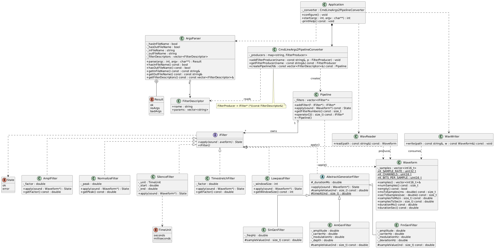

# Sound Processor

Консольный инструмент цифровой обработки звука для WAV-файлов формата **PCM, 44100 Гц, моно, 16 бит**. Читает входной сигнал (или генерирует новый), последовательно применяет цепочку фильтров и записывает результат.

## Возможности

- Чтение и запись WAV (PCM 44100/mono/16bit) с валидацией заголовков и понятными исключениями вместо аварийного падения на «битых» файлах.
- Цепочка фильтров (pipeline), задаваемая через командную строку — порядок применения соответствует порядку флагов `-f`.
- Преобразующие фильтры: изменение амплитуды, нормализация, вставка тишины, изменение длительности, ФНЧ.
- Генераторы сигналов: синусоида, амплитудная (тремоло) и частотная (вибрато) модуляция — работают и без входного файла.
- Покрытие unit-тестами (Catch2): 44 тест-кейса, 538 утверждений.

## Архитектура



Поток обработки выстраивается слоями:

| Компонент | Файлы | Назначение |
|-----------|-------|------------|
| `Waveform` | `src/core/waveform.h/.cpp` | Доменная модель моно-сигнала: буфер `int16_t` + перевод единиц времени и длительность. |
| `WavReader` / `WavWriter` | `src/core/wav_io.h/.cpp` | Бинарный ввод-вывод WAV через `__attribute__((packed))`-структуры чанков. |
| `IFilter` | `src/core/filter.h` | Абстрактный интерфейс фильтра (`apply(Waveform*) → State`) + `clampToInt16`. |
| Преобразующие фильтры | `src/filters/transform_filters.h/.cpp` | `AmplFilter`, `NormalizeFilter`, `SilenceFilter`, `TimestretchFilter`, `LowpassFilter`. |
| Генераторы | `src/filters/generator_filters.h/.cpp` | `AbstractGeneratorFilter` → `SinGenFilter`, `AmGenFilter`, `FmGenFilter`. |
| `Pipeline` | `src/core/pipeline.h/.cpp` | Владеет фильтрами, применяет их по порядку; запрет копирования, разрешено перемещение. |
| `ArgsParser` | `src/app/args_parser.h/.cpp` | Разбор `-i`/`-o`/`-f`; проверяет только синтаксис флагов. |
| `FilterDescriptor` | `src/core/filter_descriptor.h` | Имя фильтра + нераспарсенные текстовые параметры. |
| `CmdLineArgs2PipelineConverter` | `src/app/converter.h/.cpp` | Карта `имя → продюсер`, построение пайплайна из дескрипторов. |
| `FilterProducers` | `src/app/filter_producers.h/.cpp` | Функции-создатели: интерпретируют строковые параметры в конкретные фильтры. |
| `Application` / `main` | `src/app/application.h/.cpp`, `src/main.cpp` | Оркестрация: парсер → конвертер → reader → pipeline → writer; обработка исключений. |

## Сборка

Требуется CMake ≥ 3.16 и компилятор с поддержкой C++17. Catch2 v3 подтягивается автоматически через `FetchContent` (нужен доступ в интернет при первой конфигурации).

```bash
cmake -S . -B build
cmake --build build --parallel
```

Будут собраны два таргета:

- `sound_processor` — исполняемый файл;
- `test_sound_processor` — набор unit-тестов.

## Запуск тестов

```bash
./build/test_sound_processor
```

## Использование

```
sound_processor [-i input.wav] [-o output.wav] [-f имя параметры...] ...
```

| Опция | Описание |
|-------|----------|
| `-i FILE` | входной WAV-файл (если не задан — стартует с пустого сигнала) |
| `-o FILE` | выходной WAV-файл (если не задан — результат не записывается) |
| `-f ...` | фильтр и его параметры (можно указать несколько раз) |

Без аргументов выводится справка.

### Фильтры

| Фильтр | Параметры | Описание |
|--------|-----------|----------|
| `ampl` | `factor` | Умножение каждого отсчёта на коэффициент (`factor ≥ 0`), с clamp. |
| `normalize` | `[peak]` | Масштабирование пика к доле `peak` от 32767 (`0 ≤ peak ≤ 1`, по умолчанию 1). |
| `silence` | `{sec\|ms} start end` | Вставка тишины на интервале `[start, end]`. |
| `timestretch` | `factor` | Изменение длительности в `factor` раз (`factor > 0`) линейной интерполяцией. |
| `lowpass` | `window_size` | ФНЧ скользящим средним; окно нечётное, `≥ 1`. |
| `generator sin` | `frequency_hz duration_ms` | Синусоида. |
| `generator am` | `amplitude carrier_hz modulation_hz depth duration_ms` | Амплитудная модуляция (тремоло). |
| `generator fm` | `amplitude carrier_hz modulation_hz deviation_hz duration_ms` | Частотная модуляция (вибрато). |

### Примеры

Применить к файлу понижение амплитуды и растяжение вдвое:

```bash
sound_processor -i in.wav -o out.wav -f ampl 0.8 -f timestretch 2
```

Сгенерировать синусоиду 440 Гц длительностью 500 мс (без входного файла):

```bash
sound_processor -o tone.wav -f generator sin 440 500
```

Сгенерировать тремоло и нормализовать:

```bash
sound_processor -o trem.wav -f generator am 1.0 440 5 0.8 1000 -f normalize
```

## Коды возврата

| Код | Значение |
|-----|----------|
| `0` | успех |
| `1` | некорректные аргументы командной строки |
| `-1` | стандартное исключение (`std::exception`) |
| `-2` | неизвестное исключение |
